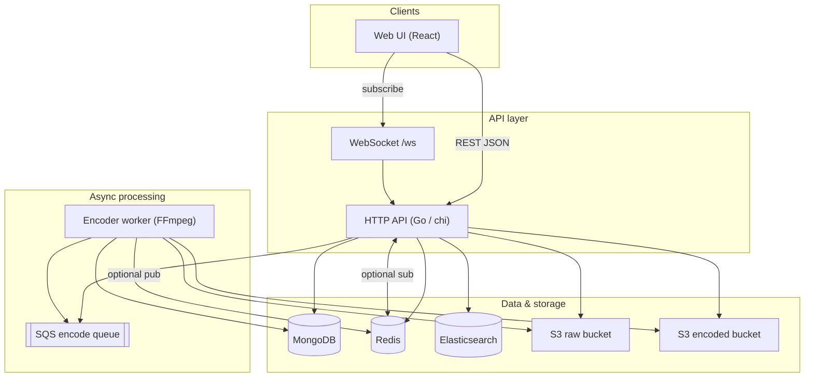
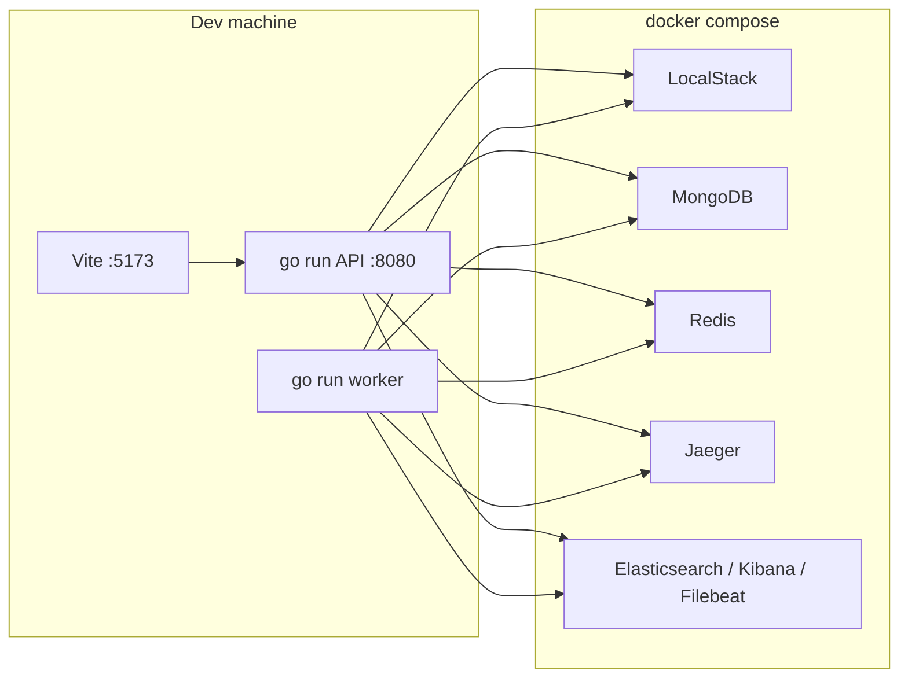

# 1. System context

## Business goals (demo scope)

Users can:

1. **Upload** a video file; the system stores the original, writes metadata, and **processes in the background** (multi-bitrate encoding).
2. **Watch** after processing completes: playback over **HLS** (adaptive / manual quality).
3. **Browse and search** the catalog (lists + full-text search when Elasticsearch is enabled).
4. **Track encode status** (processing / ready / failed) via the API and optionally **WebSockets**.

This is a **learning / reference demo**, not global CDN scale, database sharding, or millions of QPS.

## Notable technical traits

| Trait | Meaning in this demo |
|-------|----------------------|
| **Split blobs & metadata** | Large files in object storage; titles, status, playlist paths in MongoDB. |
| **Heavy work off the write path** | Upload returns quickly; encode runs **asynchronously** (SQS + worker). |
| **Read-heavy** | More reads than writes; **Redis** caches video documents; search responses may be cached. |
| **Streaming** | **HLS** output (`.ts` segments + playlists); no need to download the whole file before play starts. |
| **Observable** | Optional tracing (OTel), JSON logs, Filebeat → ES (env vars in `.env.example`; Jaeger/ES/Kibana in Compose). |

## Diagram: main components (logical)

## Diagram: local deployment (conceptual)

In production-like setups, API and worker often **also run in containers**; the diagram above reflects a common dev pattern: UI + Go on the host, infrastructure in Compose.

## Next

- **Upload & encode flow**: [02-upload-and-encoding.md](./02-upload-and-encoding.md)
