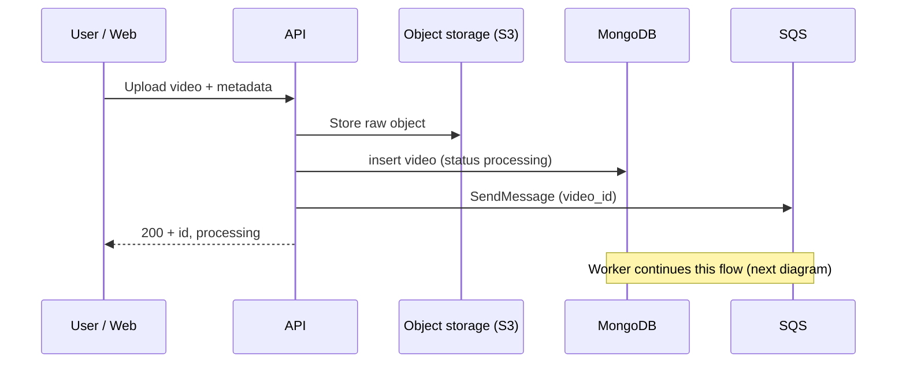
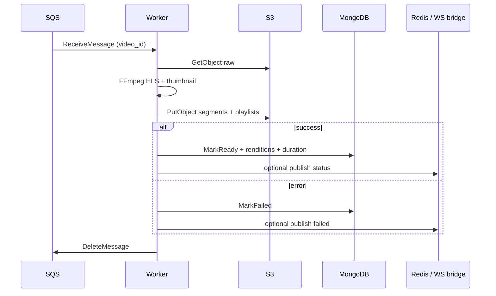
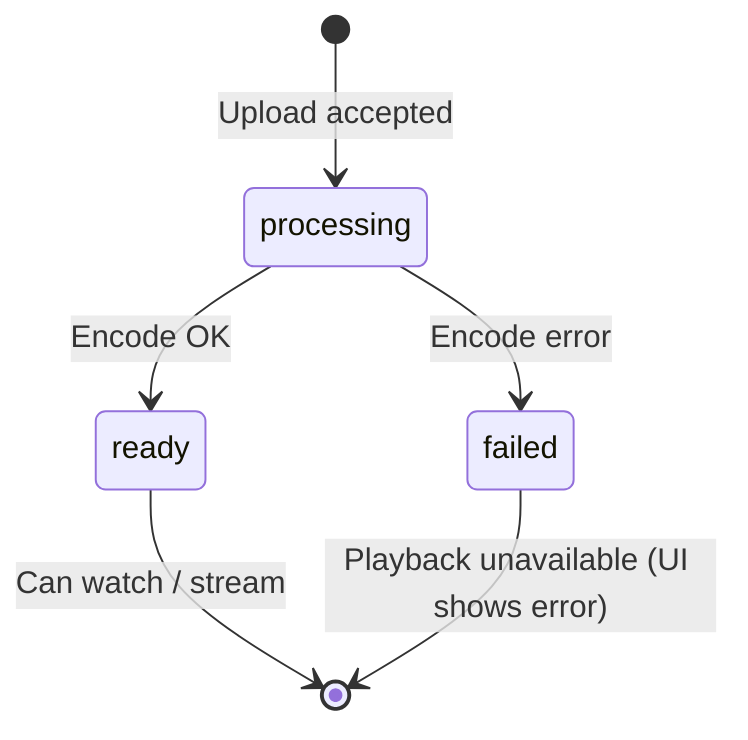

# 2. Upload & encoding (write path)

## Business flow

1. The user selects a video file, enters title / description (per form), and submits.
2. The system **accepts quickly**: stores the raw object, creates a video record in **processing** state.
3. A **worker** pulls work from the queue, downloads the original, **transcodes** (e.g. 360p + 720p HLS), uploads results to storage, then updates metadata to **ready** or **failed**.

The user **does not** wait for step 3 before getting the HTTP response from upload — matching the “decouple with queues” idea from read/write design.

## Technical details

| Aspect | In this repo |
|--------|----------------|
| Raw object | **PUT** to S3 (presigned or API-mediated upload, depending on handler) + key stored in MongoDB. |
| Metadata | One `videos` document with `status`, `raw_s3_key`, etc. |
| Encode trigger | **SQS** message carrying `video_id`. |
| Worker | Separate Go process: receive from SQS → FFmpeg → upload HLS + thumbnail → `MarkReady` / `MarkFailed`. |
| Renditions | Quality list (label + playlist path) **persisted in MongoDB** after encode, aligned with on-disk HLS layout. |

## Sequence: upload → enqueue

## Sequence: worker encode

## Video status state machine (conceptual)

## Operations notes

- **Idempotency / duplicate jobs**: depends on queue policy; the demo usually assumes one job per successful upload.
- **Search index fan-out**: after status updates, a separate queue may sync **Elasticsearch** (`SQS_VIDEO_METADATA_QUEUE_URL` and the metadata consumer in the codebase).

## See also

- Read path to play the result: [03-playback-and-streaming.md](./03-playback-and-streaming.md)
- Realtime when `ready`: [05-realtime-and-status.md](./05-realtime-and-status.md)
