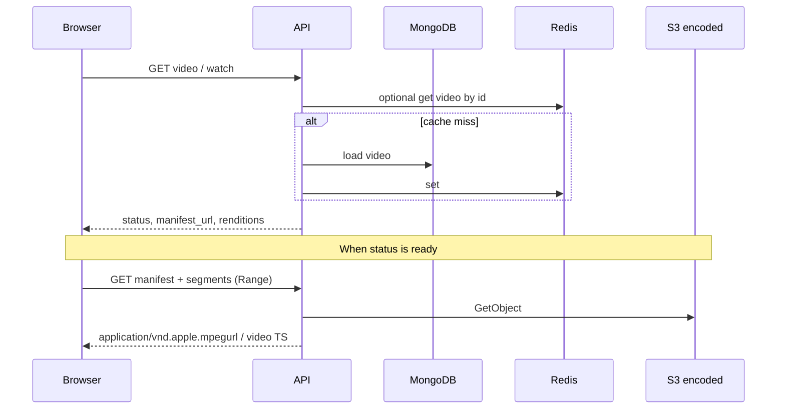
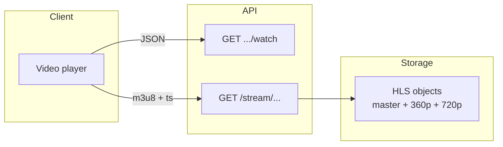

# 3. Playback & streaming (read path)

## Business flow

1. The user opens the watch page for a video `id`.
2. The client calls the API for **status**; when ready, it receives an **HLS manifest URL** and optionally **renditions** (per-quality playlist URLs).
3. The player (**native HLS** or **hls.js**) fetches `master.m3u8`, picks a variant, and downloads **segments** — playback can start before the entire asset is downloaded.

This matches “chunking & streaming” for on-demand video (TCP / HTTP suits stored content).

## Technical details

| Aspect | In the demo |
|--------|-------------|
| Playback format | **HLS** (MPEG-TS segments, master + variant playlists). |
| Segment source | Object storage served through **API stream routes** (or a CDN in larger designs). |
| Adaptive | Player / ABR may switch levels; the UI can expose fixed quality buttons when `renditions` are returned. |
| CORS / Range | HTTP streaming; API configures CORS for the web origin. |
| Not ready yet | Client polling or WebSocket updates; player mounts only when `manifest_url` exists. |

## Diagram: data flow while watching

## Diagram: playback layers (conceptual)

In real systems, a **CDN** often sits between clients and origin. This demo goes through the API to simplify auth and local dev.

## Quick comparison with larger designs

| Blog / production idea | Demo |
|------------------------|------|
| CDN near users | Single `PUBLIC_BASE_URL` to the API; no edge POP simulation. |
| Long-lived signed URLs | Possible extension; current stream URLs are public routes. |
| Many encode profiles | Two ladder rungs + “Auto” in the player. |

## See also

- Catalog metadata & search: [04-metadata-search-and-cache.md](./04-metadata-search-and-cache.md)
- Live status updates: [05-realtime-and-status.md](./05-realtime-and-status.md)
