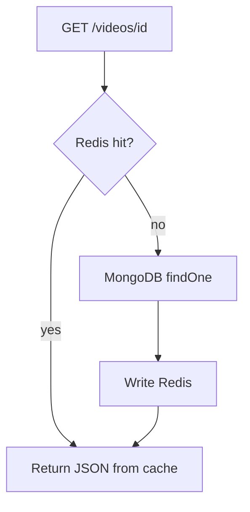
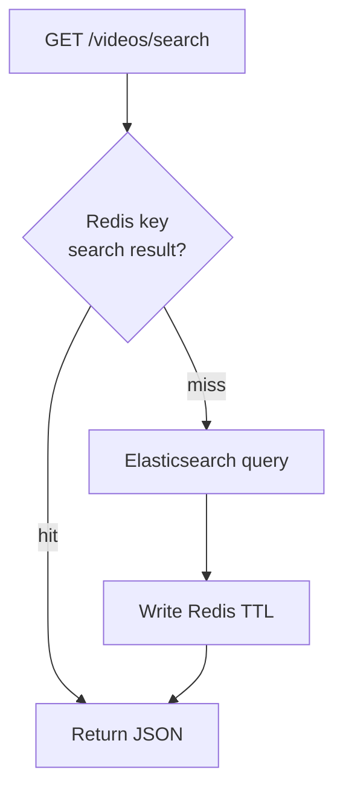
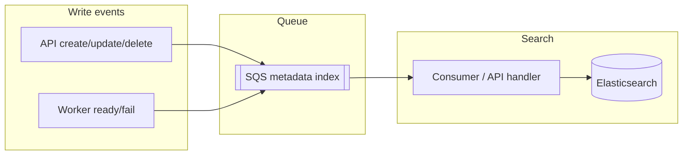

# 4. Metadata, search & cache

## Business capabilities

- **Catalog**: list videos (home, “my uploads”, …) with title, thumbnail, status.
- **Single video**: load one metadata document by id (watch page, cards, etc.).
- **Search** (when enabled): full-text / filter queries against a search index instead of scanning all of MongoDB.

## Technical details

| Component | Role |
|-----------|------|
| **MongoDB** | Source of truth for `videos` documents (encode status, S3 keys, renditions, visibility, …). |
| **Redis** | Cache video documents by id (reduces Mongo load for hot reads). TTL from env. |
| **Elasticsearch** | Search index (denormalized docs) for `GET /videos/search`; synced via a metadata pipeline (SQS + consumer). |
| **Redis (search)** | Optional cache of **search** JSON responses under a normalized key (query + page + filters). |

## Diagram: read one video (try cache, then DB)

## Diagram: search with response cache

If `REDIS_SEARCH_CACHE_TTL_SEC=0`, search result caching is disabled (per-video cache for `GET` by id may still apply depending on code paths).

## Diagram: search index sync (conceptual)

Historical reindex: run `make run-search-backfill` (or `go run ./cmd/search-backfill`) with Mongo + Elasticsearch configured in `.env`.

## See also

- Realtime UI: [05-realtime-and-status.md](./05-realtime-and-status.md)
