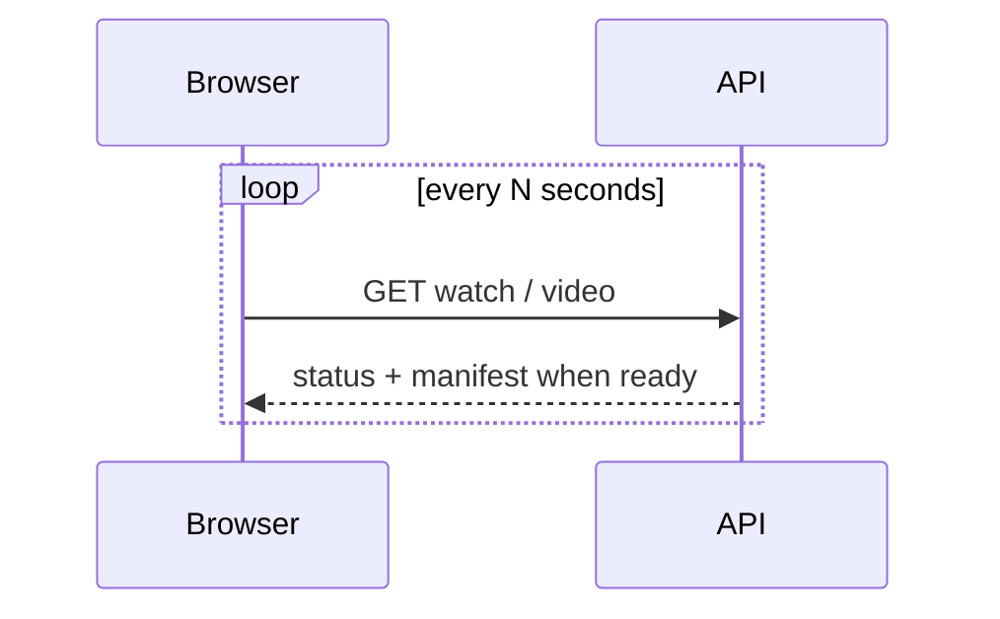
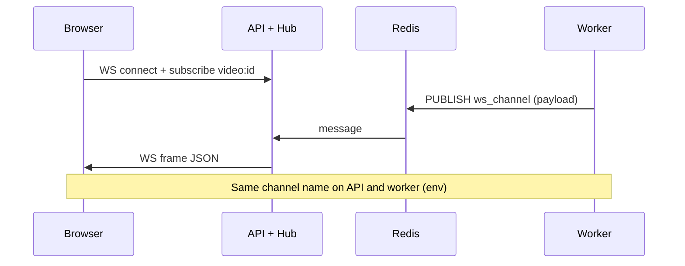
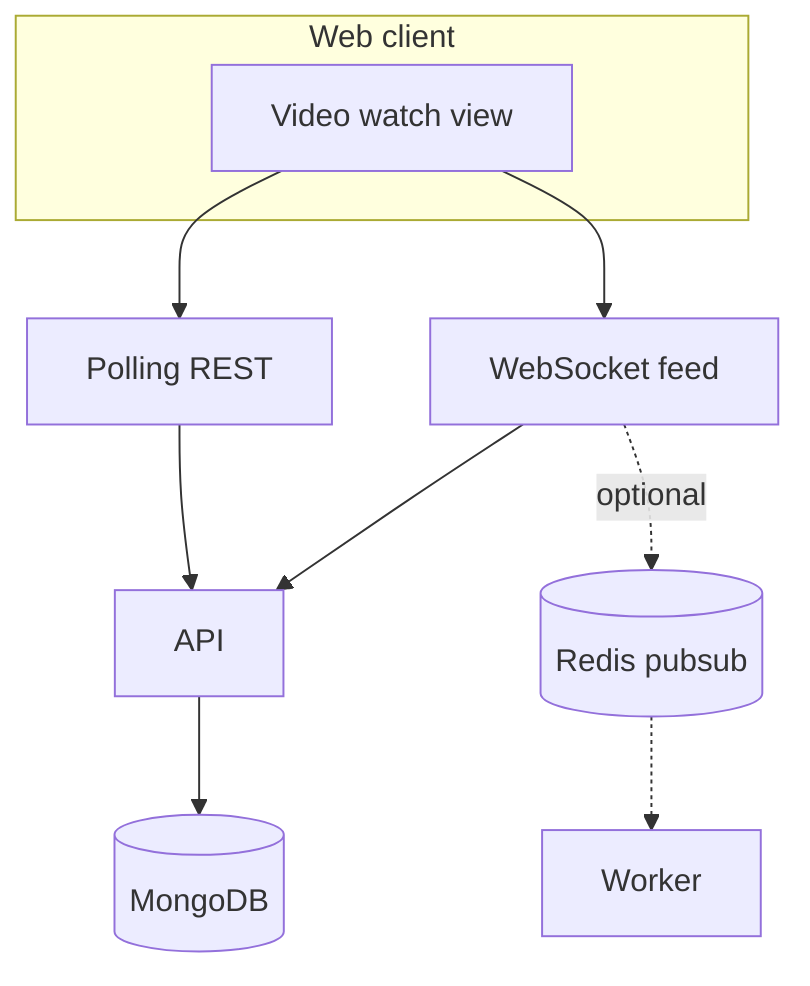

# 5. Realtime & status

## Business need

Users should see **encode status** update without a full page reload:

- Video moves from **processing** → **ready** (or **failed**) after the worker finishes.
- The watch page can **mount the player** as soon as the manifest is available.

## Technical mechanisms

| Mechanism | Description |
|-----------|-------------|
| **Polling** | Client periodically calls REST (`GET /videos/:id`, `GET /watch`) — simple and always works. |
| **WebSocket** | One connection to `GET /ws`: subscribe by topic (e.g. `video:{id}`), receive JSON payloads on changes. |
| **Redis Pub/Sub** | When API and worker are **different processes**, the worker publishes to a channel; the API process subscribes and forwards to the WebSocket hub. Without a configured channel, the hub is **in-process to the API only** — the worker cannot push to browsers directly. |

Optional security: WebSocket query token must match `WEBSOCKET_TOKEN` (see `internal/ws` and `.env.example`).

## Diagram: polling (always available)

## Diagram: WebSocket + Redis (multi-process)

## Diagram: client integration options

The client can **merge** sources: prefer WebSocket data, fall back to polling if messages are missed.

## See also

- WebSocket protocol types: `internal/ws/protocol.go` (kept in sync with `web/src/shared/ws/protocol.ts`)
- Encode path that emits events: [02-upload-and-encoding.md](./02-upload-and-encoding.md)
